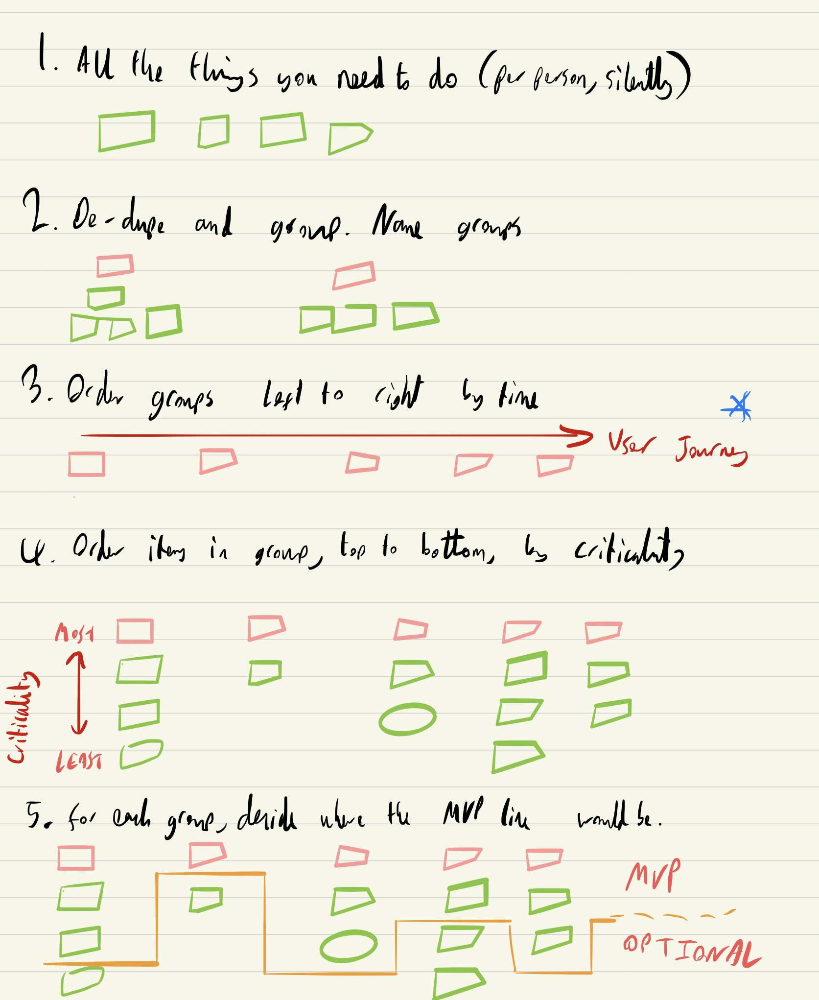
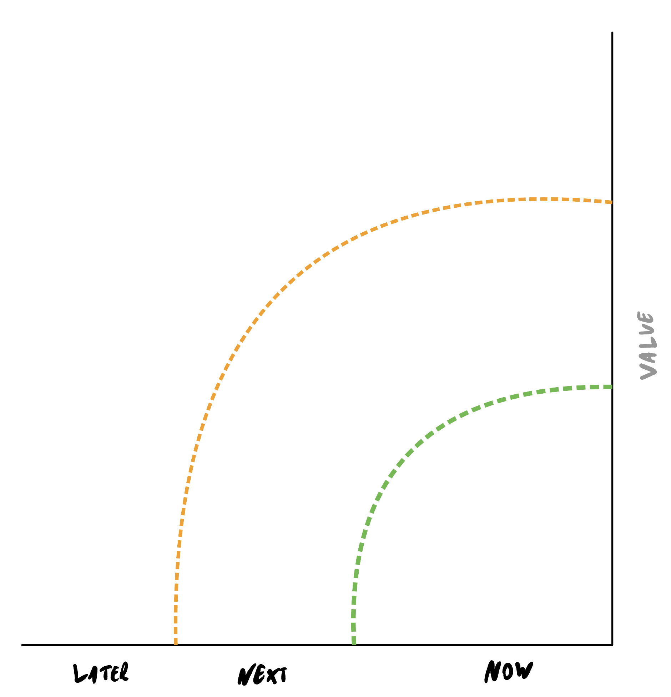
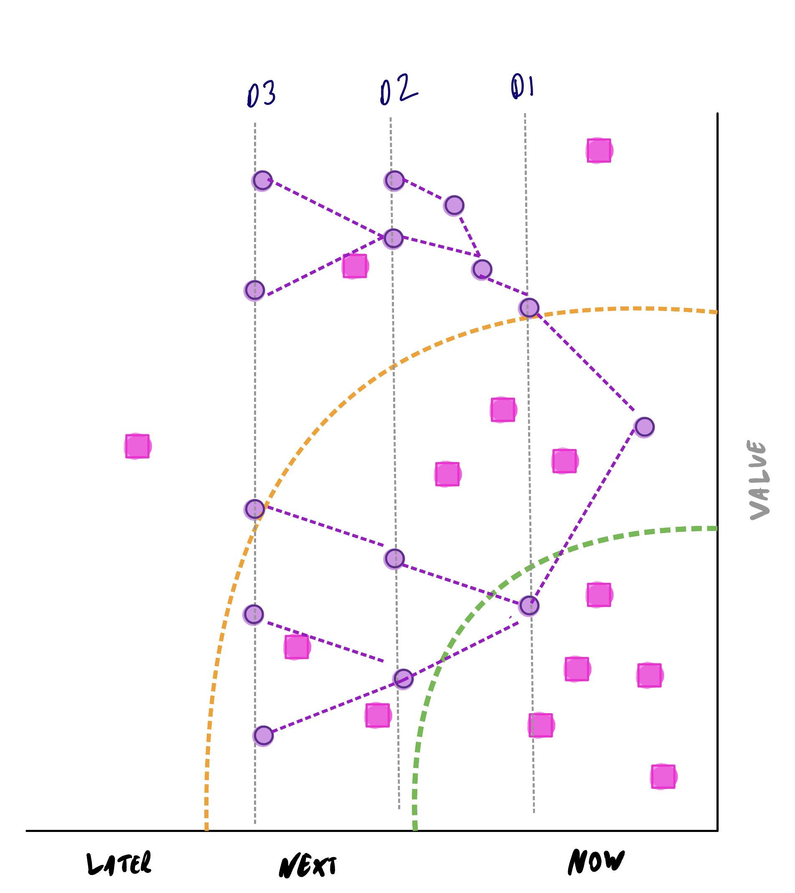

theme: Sketchnote, 1
footer: @garyfleming

<!-- ☕🍌🧁 -->
^ ☕🍌🧁

[.hide-footer]

<!-- Adaptation: To begin... To begin... How to start? I'm hungry. I should get coffee. Coffee would help me think. Maybe I should write something first, then reward myself with coffee. Coffee and a muffin. Okay, so I need to establish the themes. Maybe a banana-nut. That's a good muffin. -->
^ Adaptation: To begin... To begin... How to start? I'm hungry. I should get coffee. Coffee would help me think. Maybe I should write something first, then reward myself with coffee. Coffee and a muffin. Okay, so I need to establish the themes. Maybe a banana-nut. That's a good muffin.

---

[.hide-footer]

<!-- Getting started on new work is hard. Like a writer struggling with a blank page, teams facing new problem domains, projects, and products often don't know where to begin. Or there are so many ideas to explore and directions that could be taken, the work feels untamable; and the team gets paralysed through lack of a clear starting point. -->
^ Getting started on new work is hard. Like a writer struggling with a blank page, teams facing new problem domains, projects, and products often don't know where to begin. Or there are so many ideas to explore and directions that could be taken, the work feels untamable; and the team gets paralysed through lack of a clear starting point.

<!-- Relax. This is normal. Discovery is difficult, sometimes political, and always exciting. -->
^ Relax. This is normal. Discovery is difficult, sometimes political, and always exciting.

---

# Let's Begin: Diving Into Discovery

@garyfleming

[.hide-footer]

<!-- My name is gary fleming, I started as a developer, and then I  *WAS* an agile coach, running my own consultancy for about a decade. But I got better and went back to development. -->
^ My name is gary fleming, I started as a developer, and then I  *WAS* an agile coach, running my own consultancy for about a decade. But I got better and went back to development. 
Just when I thought I was done with agile... my org needed someone to act as an agility lead *sigh* 

---

# Let's Begin: Diving Into Discovery

@garyfleming

[.hide-footer]

<!-- This talk is called Let's Begin: Diving into Discovery and it's about Discovery, and what I learned working with a few teams at different organisations who were faced with superficially similar goals, but ended up taking radically different approaches. -->
^ This talk is called Let's Begin: Diving into Discovery and it's about Discovery, and what I learned working with a few teams at different organisations who were faced with superficially similar goals, but ended up taking radically different approaches.

---

# Disclaimer

Opinions expressed in this talk are my own, and not representative of my employer's views.

<!-- In fact, the experiences on which this talk are based happened before I started with the firm -->
^ In fact, the experiences on which this talk are based happened before I started with the firm

---

# Discovering Discovery

<!-- Let's start by trying to figure out what discovery is, why you would do it, and what shape it takes? -->
^ Let's start by trying to figure out what discovery is, why you would do it, and what shape it takes?
<!-- By that, I mean, is it a formal stringent process where you if you do A then B then C you have completed discovery, like a naive interpretation of the Scrum Guide, -->
^ By that, I mean, is it a formal stringent process where you if you do A then B then C you have completed discovery, like a naive interpretation of the Scrum Guide,
<!-- or something else? (it's something else) -->
^ or something else? (it's something else)

---

Learning about...[^1]

* Your users and what they're trying to achieve
* Constraints you'd face running the service (technology/legislative)
* Underlying intent you've been asked to address
* Opportunities to improve

[^1]: https://www.gov.uk/service-manual/agile-delivery/how-the-discovery-phase-works

<!-- I like this definition. I abbreviated it from GDS' service manual on agile delivery. They're looking at discovery through the lens of Service Design, but I think this definition applies pretty broadly. -->
^ I like this definition. I abbreviated it from GDS' service manual on agile delivery. They're looking at discovery through the lens of Service Design, but I think this definition applies pretty broadly.

---

> Before you commit to building a service, you need to understand the problem that needs to be solved.

<!-- Also starts with this. [read it] -->
^ Also starts with this. [read it]

---

[.text-strong: #E6007E]

 > **Before** you **commit** to building a service, you need to understand the problem that needs to be solved.

<!-- Focus on the before and the commit. Discovery is fundamentally an act of product assessment and risk management. You're learning what you can early enough so you can help manage expectations. What is possible anywhere, what is possible for you in your context, what is impossible (to some value of impossible), what might fail, what might succeed, where value might lie, where... -->
^ Focus on the before and the commit. Discovery is fundamentally an act of product assessment and risk management. You're learning what you can early enough so you can help manage expectations. What is possible anywhere, what is possible for you in your context, what is impossible (to some value of impossible), what might fail, what might succeed, where value might lie, where...

---

* Outcomes
* Possibility space exploration

<!-- You're  a) figuring out the kind of outcome you might want -->
^ You're  a) figuring out the kind of outcome you might want
<!-- and b) taking all of the infinite possibilities that lie before you and using various techniques to whittle down to a more manageable selection that are more *dispositional* to achieving that goal -->
^ and b) taking all of the infinite possibilities that lie before you and using various techniques to whittle down to a more manageable selection that are more *dispositional* to achieving that goal

---

# Dispositional

<!-- As an aside, we use the word "dispositional" a lot when we leave some of the more common agile tools behind (because we've accepted the fact that there are no certainties). -->
^ As an aside, we use the word "dispositional" a lot when we leave some of the more common agile tools behind (because we've accepted the fact that there are no certainties).
<!-- It simply means something that leans towards the outcome we want. -->
^ It simply means something that leans towards the outcome we want.

---

# Example

<!-- An example: if you want to have a hit blockbuster action movie with a decent size budget but cast someone who hasn't led a major film AND you give them a bad script with an questionable IP... -->
^ An example: if you want to have a hit blockbuster action movie with a decent size budget but cast someone who hasn't led a major film AND you give them a bad script with an questionable IP...

---

# It's Morbin' Time!

<!-- You end up with a flop like Morbius, with Jared Leto; he's not a proven action movie lead. -->
^ You end up with a flop like Morbius, with Jared Leto; he's not a proven action movie lead.
<!-- That said, if you find the right charistmatic unknown actor, and give them a proven IP within the framework of the most successful moneymaking cinematic project in history, it can work out just fine. -->
^ That said, if you find the right charistmatic unknown actor, and give them a proven IP within the framework of the most successful moneymaking cinematic project in history, it can work out just fine.

---

[.header: #E6007E, alignment(center)]

# WHEEEEE!

<!-- Spider-man *made* Tom Holland an incredibly bankable action star to the point that many other films he's in, like Uncharted, do better than they might because he's in them. -->
^ Spider-man *made* Tom Holland an incredibly bankable action star to the point that many other films he's in, like Uncharted, do better than they might because he's in them. 
<!-- Now is that a guarantee that every Tom Holland action film will make money, even if he's paired with Daisley Ridley the star of another blockbuster franchise? -->
^ Now is that a guarantee that every Tom Holland action film will make money, even if he's paired with Daisley Ridley the star of another blockbuster franchise?

---

[.header: #E6007E, alignment(center)]

# NOPE

<!-- NO! Most of you probably don't recognise this film FROM LAST YEAR. Chaos Walking did terribly: it lost at least $80m -->
^ NO! Most of you probably don't recognise this film FROM LAST YEAR. Chaos Walking did terribly: it lost at least $80m

---

# A SAFeR Example

<!-- I'm disposed to say, for example, that SAFe is a mostly misapplied framework that large consultancies push to clueless enterprises as a "SAFe" way to make money by repeatedly selling the same old rope, rather than engaging in any meaningful change. -->
^ I'm disposed to say, for example, that SAFe is a mostly misapplied framework that large consultancies push to clueless enterprises as a "SAFe" way to make money by repeatedly selling the same old rope, rather than engaging in any meaningful change.
<!-- That said, I will also occassionally say SAFe makes sense in your circumstances. I'm sure if you're doing it, it's definitely the latter -->
^ That said, I will also occassionally say SAFe makes sense in your circumstances. I'm sure if you're doing it, it's definitely the latter

---

# Dispositionality is an indicator, not a guarantee

<!-- ... a direction, a likelihood -->
^ ... a direction, a likelihood
<!-- Where were we before this aside? Ah yes -->
^ Where were we before this aside? Ah yes

---

[.text-strong: #E6007E]

 > **Before** you **commit** to building a service, you need to understand the problem that needs to be solved.

<!-- Seen teams committed to deliver services/products that were impossible based on the whims of people very far away from the product. -->
^ Seen teams committed to deliver services/products that were impossible based on the whims of people very far away from the product.
<!-- No avoiding that in some orgs, it helps to be armed with the best knowledge, ideas, and most importantly data that you can as EARLY AS possible. -->
^ No avoiding that in some orgs, it helps to be armed with the best knowledge, ideas, and most importantly data that you can as EARLY AS possible.
<!-- Let me reiterate: data and ideas are the way out of a bunch of bad situations. -->
^ Let me reiterate: data and ideas are the way out of a bunch of bad situations.

---

[.header: #000000, alignment(center)]

# Learn What You Need

<!-- Importantly You are NOT trying to learn everything upfront. That's simply not possible, there's far too much stuff to learn in just about any discovery or domain that requires thought. What you're trying to learn is really four things. -->
^ Importantly You are NOT trying to learn everything upfront. That's simply not possible, there's far too much stuff to learn in just about any discovery or domain that requires thought. What you're trying to learn is really four things.

---

[.header: #000000, alignment(center)]

# A. Domain

<!-- a) be talk/think/act coherently within the domain. -- Can't really do much on, say, a mapping project, if you don't understand a bit about tilesets, granularity, potentially geometric issues, possibly routing algorithms. Don't need absolute knowledge, but you do need enough to be coherent. -->
^ a) be talk/think/act coherently within the domain. -- Can't really do much on, say, a mapping project, if you don't understand a bit about tilesets, granularity, potentially geometric issues, possibly routing algorithms. Don't need absolute knowledge, but you do need enough to be coherent.
<!-- Or AWS (IAM, security groups, lambda, dynamo etc) -->
^ Or AWS (IAM, security groups, lambda, dynamo etc) 

---

[.header: #000000, alignment(center)]

# A. Domain: Ubiquitous Language

<!-- Some of that domain stuff is going to be names you're giving to ideas you're implementing. It helps to be consistent here and build a ubiquitous language. UL was solidified in DDD, but can/should be used in many teams. Find domain terms, use consistently, have one way. Lightly enforce. -->
^ Some of that domain stuff is going to be names you're giving to ideas you're implementing. It helps to be consistent here and build a ubiquitous language. UL was solidified in DDD, but can/should be used in many teams. Find domain terms, use consistently, have one way. Lightly enforce.
Ex. Map: square vs tile. 

---

[.header: #000000, alignment(center)]

# B. Goal(s)

<!-- b) to find clear, coherent goals that'll help you ensure you're going in the right direction -- As you can speak/think about the domain in the terms of the domain, you can start to figure out your goals within that framework of understanding. (Why customer cares) "We initially want to achieve something like X, and Y and Z are kinda interesting too" "We know we've succeeded when..." -->
^ b) to find clear, coherent goals that'll help you ensure you're going in the right direction -- As you can speak/think about the domain in the terms of the domain, you can start to figure out your goals within that framework of understanding. (Why customer cares) "We initially want to achieve something like X, and Y and Z are kinda interesting too" "We know we've succeeded when..."
"Walking app for hills, aligned to bagging munros with minimal repeated descents." "Might eventually do country hikes" "Succeeded when reasonable routes for all munros"

---

[.header: #000000, alignment(center)]

# C. Nope

<!-- C) to know what you're not doing. -->
^ C) to know what you're not doing.

<!-- An important part of figuring out how to explore safely and heading towards your goal is to be clear about the things you're not going after, or at least not going after initially. This will keep you clear and focussed until there's a reason to expand. -->
^ An important part of figuring out how to explore safely and heading towards your goal is to be clear about the things you're not going after, or at least not going after initially. This will keep you clear and focussed until there's a reason to expand. 
<!-- Hillwalking example: Detailed urban centres with cafe names, menus etc, not that important. Less detail in cities, more on connecting routes -->
^ Hillwalking example: Detailed urban centres with cafe names, menus etc, not that important. Less detail in cities, more on connecting routes

---

[.header: #000000, alignment(center)]

# D. Explore

<!-- D) to explore the space so you can find risks and pathways forward, -->
^ D) to explore the space so you can find risks and pathways forward, 

<!-- bias to action, trying things that are likely to help us learn, or help us finding risks. roadmaps. -->
^ bias to action, trying things that are likely to help us learn, or help us finding risks. roadmaps.

---

[.header: #000000, alignment(center)]

# ABCD. All At Once, Looping

<!-- And here's the thing, you're going to do these things all at the same time, in a swirling dynamic of learning; The places not to go inform the places to go and the routes we might take and the domain we need to take interest in, which informs our understanding of our goals, which make certain paths dispositional... over and over until until... we'll get to that. -->
^ And here's the thing, you're going to do these things all at the same time, in a swirling dynamic of learning; The places not to go inform the places to go and the routes we might take and the domain we need to take interest in, which informs our understanding of our goals, which make certain paths dispositional... over and over until until... we'll get to that.

---

[.text: text-scale(2.0)]

But what do?

<!-- That's a lot of big vague words, but you're a busy person and need to actually do something. Scrum has this big guide, with ceremonies, and roles, and a whole thing to follow. If you're naive, you could follow that dogmatically and at least you'd be doing something. It'd be terrible, but it might be something. Can you have something like that, but for discovery? -->
^ That's a lot of big vague words, but you're a busy person and need to actually do something. Scrum has this big guide, with ceremonies, and roles, and a whole thing to follow. If you're naive, you could follow that dogmatically and at least you'd be doing something. It'd be terrible, but it might be something. Can you have something like that, but for discovery?

---

[.text: text-scale(2.0)]

No. 

---

[.text: text-scale(2.0)]

No. (Maybe?)

<!-- Well, maybe something. Effective agility is about arming yourself with tools and recipes, and trying them against problems. Then being honest about yourself with their shortfalls, imagining/learning new tools, and trying those. These tools and recipes won't work for you in every situation. Have to find the right fit. -->
^ Well, maybe something. Effective agility is about arming yourself with tools and recipes, and trying them against problems. Then being honest about yourself with their shortfalls, imagining/learning new tools, and trying those. These tools and recipes won't work for you in every situation. Have to find the right fit.
<!-- There are processes out there for Discovery that do some of this in some contexts and work to some extent -->
^ There are processes out there for Discovery that do some of this in some contexts and work to some extent

---

# Design Sprints

* Map the problem
* Sketch competing solutions
* Decide
* Couple of prototypes
* Test

<!-- Things like Design Sprints (5 days to prototype) are a handy tool (explain points). Each point has a fairly rigorous guide in the book Sprint, by Jake Knapp. If you have the right kind of problem (small, understood), it's a decent way of doing Discovery. -->
^ Things like Design Sprints (5 days to prototype) are a handy tool (explain points). Each point has a fairly rigorous guide in the book Sprint, by Jake Knapp. If you have the right kind of problem (small, understood), it's a decent way of doing Discovery. 

---

# For other shapes and kinds of problems?

<!-- What if we have problems that aren't small or well understood? What if we have problems that we need to explore a bit to understand, or that are chunky enough that we know it'll be too big for a week-long scope. -->
^ What if we have problems that aren't small or well understood? What if we have problems that we need to explore a bit to understand, or that are chunky enough that we know it'll be too big for a week-long scope.

---

# Cynefin

[.header: #E6007E]

<!-- Cynefin is a lens for this. It can help figure out appropriate approaches to take depending on what you know and what you don't know. -->
^ Cynefin is a lens for this. It can help figure out appropriate approaches to take depending on what you know and what you don't know.
<!-- Now, I'm not going to explain all of Cynefin, or the many ways you can use it. That'd be a full talk by itself. I'm going to explain a handful of concepts from it. -->
^ Now, I'm not going to explain all of Cynefin, or the many ways you can use it. That'd be a full talk by itself. I'm going to explain a handful of concepts from it.

---

# ⚠️⚠️⚠️

<!-- I have to give you a warning: if you go off and learn more about Cynefin, it can have dangerous side effects. It acts as a gateway drug to complexity thinking. Handle with care, speak to a professional before any shallow dives into Chaos, and do not stare directly at aporia. -->
^ I have to give you a warning: if you go off and learn more about Cynefin, it can have dangerous side effects. It acts as a gateway drug to complexity thinking. Handle with care, speak to a professional before any shallow dives into Chaos, and do not stare directly at aporia.

---

<!-- Primarily it's a sense-making tool, not a categorisation tool. Not about where things live, but how to move things between them, how we'd like them to act, and how we'd like to act with them; that is the dynamics. (going light on dynamics too) -->
^ Primarily it's a sense-making tool, not a categorisation tool. Not about where things live, but how to move things between them, how we'd like them to act, and how we'd like to act with them; that is the dynamics. (going light on dynamics too)

---

<!-- Let me strip a bunch of that away and focus on a few things, initially the difference between the ordered and unordered sides -->
^ Let me strip a bunch of that away and focus on a few things, initially the difference between the ordered and unordered sides
<!-- the RHS is Ordered. We can apply rules or expertise -->
^ the RHS is Ordered. We can apply rules or expertise
<!-- Ordered solutions can be examined, evaluated, processified, turning into training... So there are reasonably predictable processes we can follow to work those solutions. -->
^ Ordered solutions can be examined, evaluated, processified, turning into training... So there are reasonably predictable processes we can follow to work those solutions.
<!-- might know how to layout map tiles. Rules around how to scale the map. -->
^ might know how to layout map tiles. Rules around how to scale the map.

---

[.header: #E6007E, alignment(center)]

# Ordered processes: User Story Mapping

<!-- If you think you collectively have the expertise on-hand to solve the problem, then it might be as simple as building an initial user story map. -->
^ If you think you collectively have the expertise on-hand to solve the problem, then it might be as simple as building an initial user story map.

---

<!-- Have everyone individually break down the problem, bring them together to create a collective view, group/dedupe, name the groups, order the groups, and argue about what's MVP based on your goals. -->
^ Have everyone individually break down the problem, bring them together to create a collective view, group/dedupe, name the groups, order the groups, and argue about what's MVP based on your goals.
<!-- Guide with UL, goals, and your nopes. -->
^ Guide with UL, goals, and your nopes.

<!-- TODO expand with USM examples/ images. MVP line focussed on goals. Building UL. Treat as simple roadmap. Placeholder for now -->
^ TODO expand with USM examples/ images. MVP line focussed on goals. Building UL. Treat as simple roadmap. Placeholder for now

---

[.header: #E6007E, alignment(center)]

<!-- Importantly you don't have to know absolutely everything. Doing this process will help you focus on the things you know you know, and the things you know you don't know. You then get to treat the later the same way you'd treat anything else in unordered... which I'll explain later... which is now. -->
^ Importantly you don't have to know absolutely everything. Doing this process will help you focus on the things you know you know, and the things you know you don't know. You then get to treat the later the same way you'd treat anything else in unordered... which I'll explain later... which is now.

---

<!-- Unordered solutions are where you know you don't know, but you think you could know. -->
^ Unordered solutions are where you know you don't know, but you think you could know.
<!-- Unordered solutions can be examined for heuristics -> evaluating principles that achieve the goal, but very changeable, must be re-evaluated -->
^ Unordered solutions can be examined for heuristics -> evaluating principles that achieve the goal, but very changeable, must be re-evaluated
<!-- Maybe we don't know how to do routing between points on a complex terrain map, but we can come up with a measure of effectiveness for routing algos (distance, rapid ascent/descent) and try them -->
^ Maybe we don't know how to do routing between points on a complex terrain map, but we can come up with a measure of effectiveness for routing algos (distance, rapid ascent/descent) and try them

---

[.header: #E6007E]

# Experiment.

<!-- You figure out these solutions by trying lots of safe-to-fail probes. Experiments. You go and do mini-experiments and evaluate them against heuristics that guide you -->
^ You figure out these solutions by trying lots of safe-to-fail probes. Experiments. You go and do mini-experiments and evaluate them against heuristics that guide you
<!-- ZOOM AND ENHANCE -->
^ ZOOM AND ENHANCE

---

<!-- By trying different things that get us some data, we arm ourselves with options and close off pathways that we think will work. Eventually, we hopefully find some options to help us push our understanding from unordered (know we don't know) into ordered (know we know) -->
^ By trying different things that get us some data, we arm ourselves with options and close off pathways that we think will work. Eventually, we hopefully find some options to help us push our understanding from unordered (know we don't know) into ordered (know we know)
<!-- ex. some branches might focus on distance, others on steepness. Might bring back aspects of both. -->
^ ex. some branches might focus on distance, others on steepness. Might bring back aspects of both.
<!-- Eventually we might grow enough expertise that it becomes ordered -->
^ Eventually we might grow enough expertise that it becomes ordered

---

[.header: #E6007E]

# 1. Get it right.

<!-- It's important that we pick the right tools to apply. If you were to use an experimental approach on something you mostly collectively know, you're going to waste a lot of time. -->
^ It's important that we pick the right tools to apply. If you were to use an experimental approach on something you mostly collectively know, you're going to waste a lot of time.
<!-- If you use an ordered approach (USM) on something you don't know, you'll fumble, feel lost, lose morale and wonder why it feels so hard. -->
^ If you use an ordered approach (USM) on something you don't know, you'll fumble, feel lost, lose morale and wonder why it feels so hard.

---

[.header: #E6007E]

# 2. Split it up.

<!-- Most importantly, feel free to use both! Each for the right part. As you learn which parts are ordered/unordered, change your approach. -->
^ Most importantly, feel free to use both! Each for the right part. As you learn which parts are ordered/unordered, change your approach.

---

[.header: #E6007E]

# 3. Move forward.

<!-- Don't allow yourself to become paralysed by indecision. Whichever side you're on, you can either make progress on learning more, or doing more. It's fine to be cautious, but stopping rarely helps -->
^ Don't allow yourself to become paralysed by indecision. Whichever side you're on, you can either make progress on learning more, or doing more. It's fine to be cautious, but stopping rarely helps

---

# Experiments? But I need Dates!

<!-- Now, some of you are probably thinking that all this talk of experiments and learning sounds great and all but you've got customers/stakeholders who expect results. They want dates, and deadlines, and roadmaps. -->
^ Now, some of you are probably thinking that all this talk of experiments and learning sounds great and all but you've got customers/stakeholders who expect results. They want dates, and deadlines, and roadmaps.

---

> "[Organisations struggle because] the delivery work is valued more than the learning work" -- Jeff Gothelf

<!-- I think it was Jeff Gothelf who said this [read it]. He's right, you're being silly. Doing, doing, doing is a recipe for waste. You're often putting in a lot more effort into features/products that could've been eliminated with a simple experiment. We MUST learn. It's too risky and too costly not to learn. -->
^ I think it was Jeff Gothelf who said this [read it]. He's right, you're being silly. Doing, doing, doing is a recipe for waste. You're often putting in a lot more effort into features/products that could've been eliminated with a simple experiment. We MUST learn. It's too risky and too costly not to learn.

---

# Good news!

[.header: #E6007E]

<!-- The good news is that you can have your roadmap AND learning. They're not mutually exclusive. In fact in most circumstances you kinda need to have both. -->
^ The good news is that you can have your roadmap AND learning. They're not mutually exclusive. In fact in most circumstances you kinda need to have both.
<!-- You need learning that informs your delivery and delivery to inform what to learn next. -->
^ You need learning that informs your delivery and delivery to inform what to learn next.

---

# Roadmaps

[.header: #E6007E]

<!-- Let's inspect the metaphor for just a second. Have you ever seen a roadmap? One of the things you'll notice pretty quickly is that they have a bunch of branching options to get between two different points. Roadmaps have OPTIONALITY. What do we call a roadmap without options? A Road. -->
^ Let's inspect the metaphor for just a second. Have you ever seen a roadmap? One of the things you'll notice pretty quickly is that they have a bunch of branching options to get between two different points. Roadmaps have OPTIONALITY. What do we call a roadmap without options? A Road.

---

# Roadmaps

[.header: #E6007E]

<!-- You might also argue that if you know where you're starting, and know where you're ending, that there is probably a preferred best route. -->
^ You might also argue that if you know where you're starting, and know where you're ending, that there is probably a preferred best route.
<!-- That is there is a route when dealing with ORDERED planning (known knowns) that is disposed to being best. -->
^ That is there is a route when dealing with ORDERED planning (known knowns) that is disposed to being best.

---

# Roadmaps

[.header: #E6007E]

<!-- Will it absolutely always be best? Probably not. Various unexpected things, like crashes or roadworks, will mean there are other better routes at any given time. Will we always know exactly where our destination is? Nope. So we need other techniques, and different techniques in each case. -->
^ Will it absolutely always be best? Probably not. Various unexpected things, like crashes or roadworks, will mean there are other better routes at any given time. Will we always know exactly where our destination is? Nope. So we need other techniques, and different techniques in each case.

---

# Ordered: Now Next later

[.header: #E6007E, alignment(center)]

<!-- A now next later map is a reasonable style of roadmap to use, that doesn't necessarily have any dates on it, when dealing with something that's ordered. It's usually relative in time, rather than prescriptive... -->
^ A now next later map is a reasonable style of roadmap to use, that doesn't necessarily have any dates on it, when dealing with something that's ordered. It's usually relative in time, rather than prescriptive...
<!-- I prefer this 2d version: one axis for "urgency" (more urgent towards origin) and one for a different concern like "value" (more value towards origin). -->
^ I prefer this 2d version: one axis for "urgency" (more urgent towards origin) and one for a different concern like "value" (more value towards origin).

---

<!-- We can put our work into this framework at different levels of granularity and have conversations about tradeoffs. -->
^ We can put our work into this framework at different levels of granularity and have conversations about tradeoffs.
<!-- Too many in now? What needs moved out? -->
^ Too many in now? What needs moved out?
<!-- Lots in later? Will they get done ever? Are they dream items? Can we remove them? -->
^ Lots in later? Will they get done ever? Are they dream items? Can we remove them?
<!-- "Stakeholder says something is URGENT but it's low value" -->
^ "Stakeholder says something is URGENT but it's low value"
<!-- Focus on those conversations and feel. Not precision. -->
^ Focus on those conversations and feel. Not precision.

---

# Unordered: Strategic Roadmap

[.header: #E6007E, alignment(center)]

<!-- What if we don't know what to build i.e. we're doing something unordered? -->
^ What if we don't know what to build i.e. we're doing something unordered?
We know our current state, we've got an idea about our goals, and direction, but there's a lot of unknowns.
<!-- We need a roadmap that helps with this -->
^ We need a roadmap that helps with this

---

<!-- This kind of strategic roadmap can be used. We can focus on experiments or other knowledge gathering work that will help us make the decisions we need to make. The vertical lines here represent decision points: points in our timeline where we know we're going to need to make a decision or have gathered enough knowledge about our goals so we can (these might be month or quarter markers). The purple circles might be experiments or outcomes that lead us forward, -->
^ This kind of strategic roadmap can be used. We can focus on experiments or other knowledge gathering work that will help us make the decisions we need to make. The vertical lines here represent decision points: points in our timeline where we know we're going to need to make a decision or have gathered enough knowledge about our goals so we can (these might be month or quarter markers). The purple circles might be experiments or outcomes that lead us forward,

---

<!-- We can overlay the views if we want. Gets busier, harder to use, but does let us ask: are the items we're working on necessary and sufficient to learn what we need to make decisions for our goals? -->
^ We can overlay the views if we want. Gets busier, harder to use, but does let us ask: are the items we're working on necessary and sufficient to learn what we need to make decisions for our goals?

---

<!-- When should we stop discovering? What will it look like when we're done? -->
^ When should we stop discovering? What will it look like when we're done?
<!-- Well, problems are done when they're done. Some never die, and should be in perpetual discovery, and some are tightly bounded. -->
^ Well, problems are done when they're done. Some never die, and should be in perpetual discovery, and some are tightly bounded.

---

> "...early and continuous delivery of valuable software."

<!-- In the short term, switch more focus away from discovery and into production as and when you believe you've learned enough to get value. Putting things into production IS one way of doing discovery. Do so safely. -->
^ In the short term, switch more focus away from discovery and into production as and when you believe you've learned enough to get value. Putting things into production IS one way of doing discovery. Do so safely.

---

> "Existence is the first and truest proof of the right to exist. Those who cannot claim and hold existence do not deserve it."

<!-- If you can't put things into production, available for real customers to really exist, you will stop existing. Reality is the only true test. Existence is the only meaningful proof of the right to exist. -->
^ If you can't put things into production, available for real customers to really exist, you will stop existing. Reality is the only true test. Existence is the only meaningful proof of the right to exist.

---

<!-- Stop when you believe the value to be mined from solutions is less than the cost to do it. -->
^ Stop when you believe the value to be mined from solutions is less than the cost to do it.
<!-- Stop when you have produced the understanding you need to do all the work you'll ever do on product. -->
^ Stop when you have produced the understanding you need to do all the work you'll ever do on product.
<!-- Stop when it's done. -->
^ Stop when it's done.

---

# SUMMARY

- Domain, goal, explore, nope
- Ordered vs unordered (Cynefin)
- Know When To Stop (Keep learning)

<!-- TODO make this explicit -->
^ TODO make this explicit

---

## Secret Summary

[.header: #E6007E, alignment(center)]

<!-- But the actual secret message is to allow for optionality, use dispositionality, look at the world through complexity. -->
^ But the actual secret message is to allow for optionality, use dispositionality, look at the world through complexity.
<!-- Because straight lines in discovery are false confidence. We want roadmaps, not roads. Options, not false certainty. -->
^ Because straight lines in discovery are false confidence. We want roadmaps, not roads. Options, not false certainty.

---

# Thanks!

## ☕🍌🧁

@garyfleming
https://bit.ly/lets-begin-discovery

[.hide-footer]

<!-- I'm stopping because I'm done. -->
^ I'm stopping because I'm done.
<!-- Slides will be on twitter. -->
^ Slides will be on twitter.

