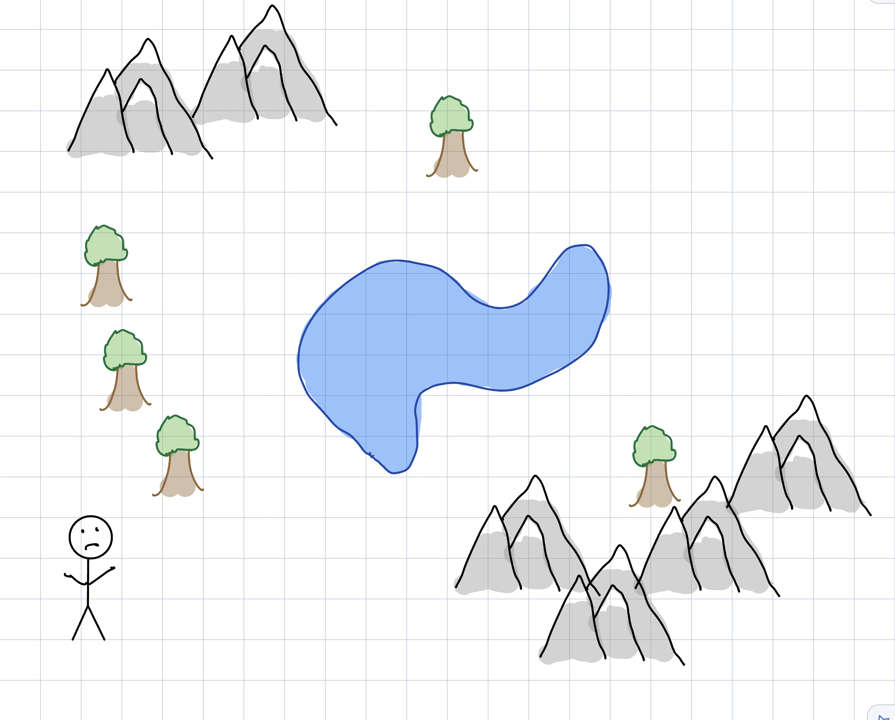
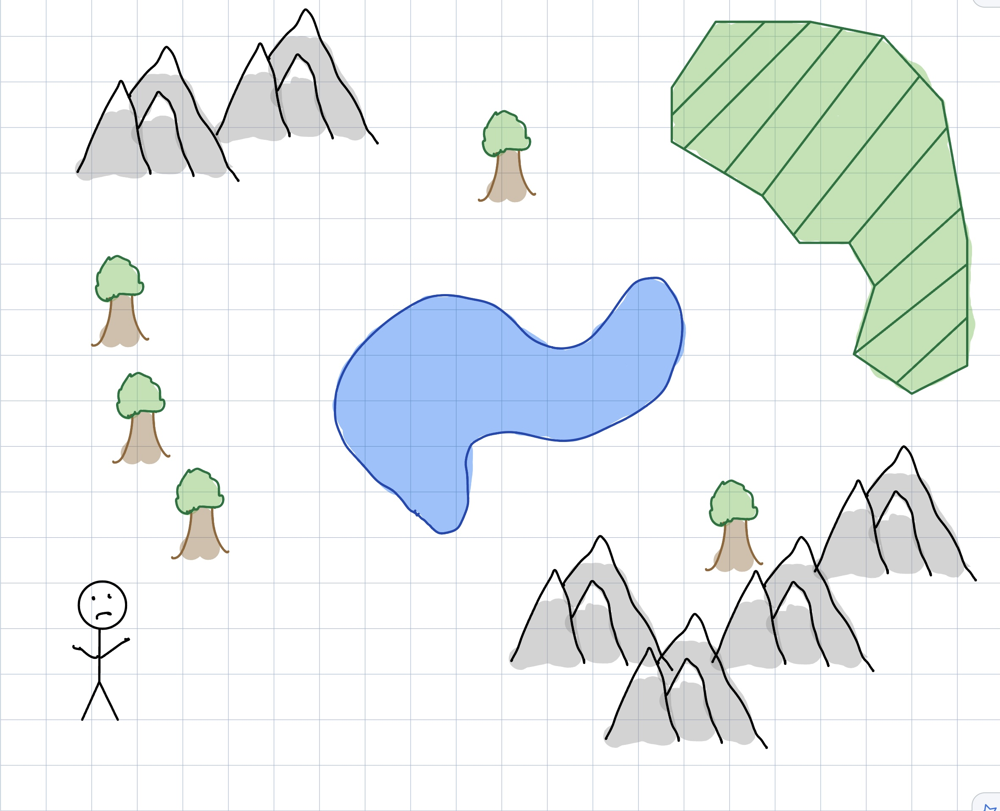
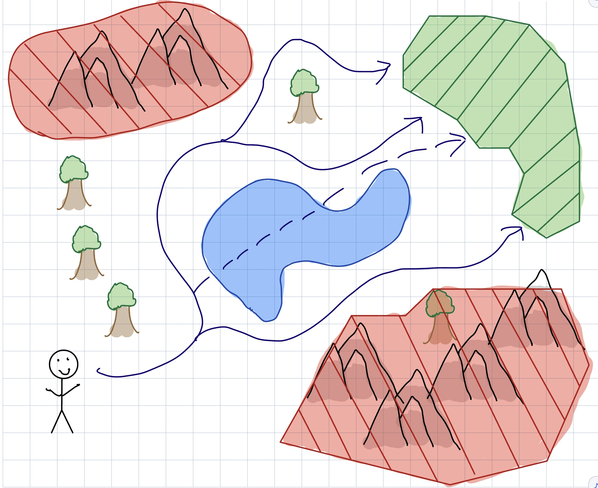
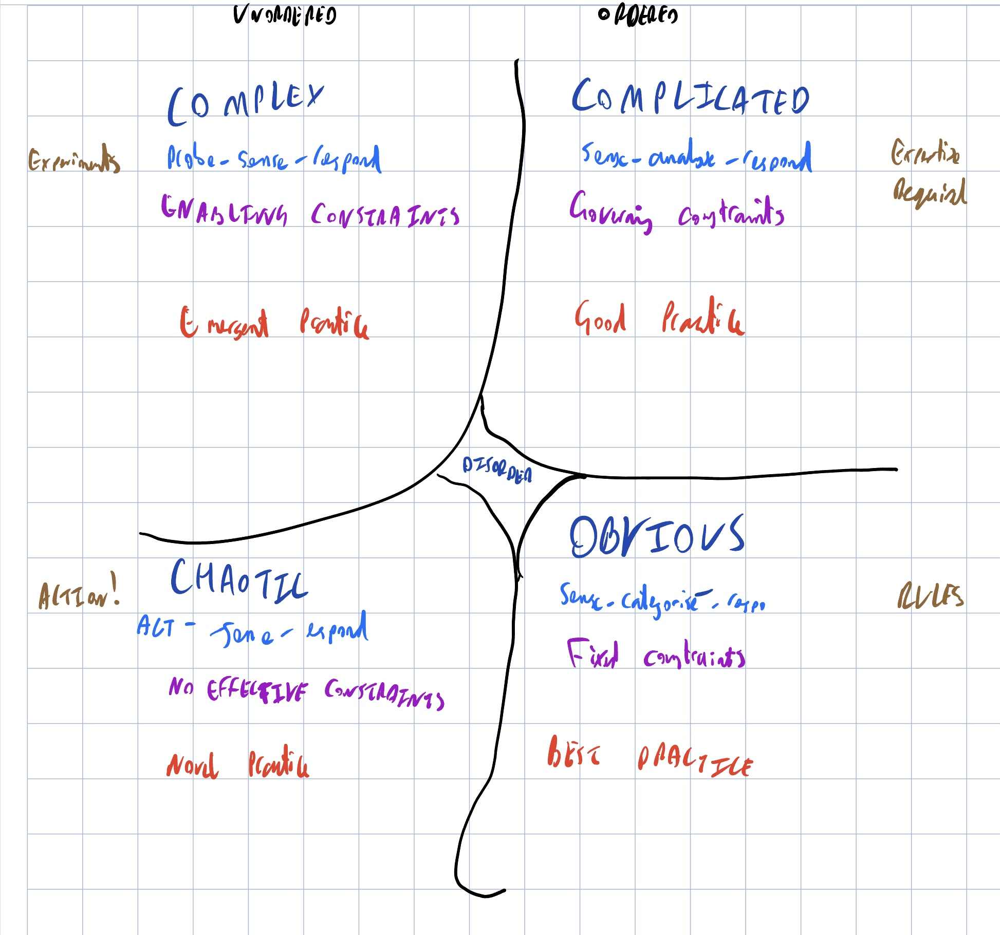
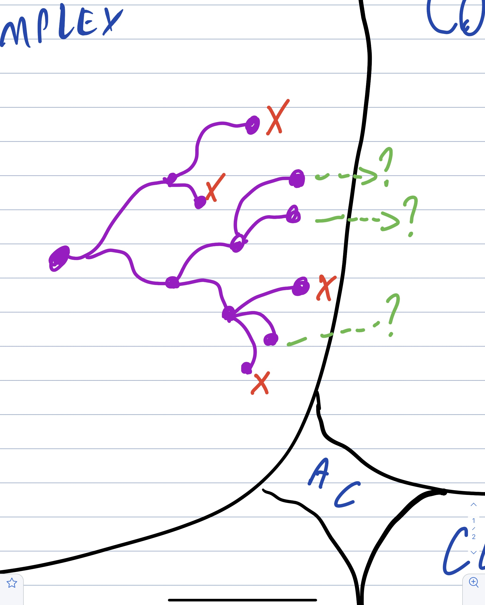

theme: Sketchnote, 1

^ INTERNAL PRELUDE:
^ This is a conference talk. Not about discovery in our context or, really, anyone's. It's ideas to inspire and show what's possible.
^ Draft: first time, scrappy, incomplete, bumpy. You're my guinea-pirates

---

^ I want feedback. Whats interesting, confusing, more of, ditch. Ordering issues. Most important: "I don't understand that"

---

^ ☕🍌🧁

^ Adaptation: To begin... To begin... How to start? I'm hungry. I should get coffee. Coffee would help me think. Maybe I should write something first, then reward myself with coffee. Coffee and a muffin. Okay, so I need to establish the themes. Maybe a banana-nut. That's a good muffin.

---

^ Getting started on new work is hard. Like a writer struggling with a blank page, teams facing new problem domains, projects, and products often don't know where to begin. Or there are so many ideas to explore and directions that could be taken, the work feels untamable; and the team gets paralysed through lack of a clear starting point.

^ Relax. This is normal. Discovery is difficult, sometimes political, and always exciting.

---

# Let's Begin: Diving Into Discovery

@garyfleming

^ My name is gary fleming, I *WAS* an agile coach, running my own consultancy for about a decade, but I'm getting better now.
In the context of [work] I'm [what I do at work]
That said, every time I get out they drag me back in. 

---

^ This talk is called Let's Begin: Diving into Discovery and it's about Discovery, and what I worked learning with a few teams. And it's important you understand something here, near the start.

---

# Disclaimer

1) None of this happened at my current employer. My views are my own etc (TODO pull actual wording)

---

# Discovering Discovery

^ Let's start by tryig to figure out what discovery is, why you would do it, and what shape it takes?
^ By that, I mean, is it a formal stringent process where you if you do A then B then C you have completed discovery, like a naive interpretation of the Scrum Guide,
^ or something else? (it's something else)

---

Learning about...[^1]

* Your users and what they're trying to achieve
* constrains you'd face running the service (technology/legislative)
* Underlying intent you've been asked to address
* Opportunities to improve

[^1]: https://www.gov.uk/service-manual/agile-delivery/how-the-discovery-phase-works

^ I like this definition. I abbreviated it from GDS' service manual on agile delivery. They're looking at discovery through the lens of Service Design, but I think this definition applies pretty broadly.

---

> Before you commit to building a service, you need to understand the problem that needs to be solved.

^ Also starts with this. [read it]

---

[.text-strong: #E6007E]

 > **Before** you **commit** to building a service, you need to understand the problem that needs to be solved.

^ Focus on the before and the commit. Discovery is fundamentally an act of product assessment and risk management. You're learning what you can early enough so you can help manage expectations. What is possible anywhere, what is possible for you in your context, what is impossible (to some value of impossible), what might fail, what might succeed, where value might lie, where...

---

* Outcomes
* Possibility space exploration

^ You're  a) figuring out the kind of outcome you might want
^ and b) taking all of the infinite possibilities that lie before you and using various techniques to whittle down to a more manageable selection that are more *dispositional* to achieving that goal

^ TODO does this tie into a later bit?

---

# Dispositional

^ As an aside, we use the word "dispositional" a lot when we leave some of the more common agile tools behind (because we've accepted the fact that there are no certainties).
^ It simply means something that leans towards the outcome we want.

---

# Example

^ An example: if you want to have a hit blockbuster action movie with a decent size budget but cast someone who hasn't led a major film AND you give them a bad script with an questionable IP...

---

# It's Morbin' Time!

^ You end up with a flop like Jared Leto In Morbius; he's not a proven action movie lead and probably won't be now.
^ That said, if you find the right charistmatic unknown actor, and give them a proven IP within the framework of the most successful moneymaking cinematic project in history, it can work out just fine.

---

[.header: #E6007E, alignment(center)]

# WHEEEEE!

^ Spider-man *made* Tom Holland an incredibly bankable action star to the point that questionable films like Uncharted still made money.
^ Now is that a guarantee that every Tom Holland action film will make money, even if he's paired with the star of another blockbuster franchise?

---

[.header: #E6007E, alignment(center)]

# NOPE

^ NO! Everyone who saw Chaos Walking knows that was an absolutely mess that lost at least $80m, and Tom Holland was lucky to walk away from that with a career.

---

# A SAFeR Example

^ I'm disposed to say, for example, that SAFe is a mostly misapplied framework that large consultancies push to clueless enterprises as a "SAFe" way to make money by repeatedly selling the same old rope, rather than engaging in any meaningful change.
^ That said, I will also occassionally say SAFe makes sense in your circumstances. I'm sure if you're doing it, it's definitely the latter

---

# Dispositionality is an indicator, not a guarantee

^ ... a direction, a likelihood
^ Where were we before this aside? Ah yes

---

[.text-strong: #E6007E]

 > **Before** you **commit** to building a service, you need to understand the problem that needs to be solved.

^ I've seen teams committed to deliver services and products that were basically impossible based on the whims and fancies of people very far away from the product. While there's no avoiding that in some orgs, it helps to be armed with the best knowledge, ideas, and most importantly data that you can as EARLY AS possible. While some managers will never take their fingers out of their ears and continue to demand the impossible, many/most will listen to reason backed by data and ideas. Let me reiterate: data and ideas are the way out of a bunch of bad situations.

---

[.header: #000000, alignment(center)]

# Learn

^ Importantly You are NOT trying to learn everything upfront. That's simply not possible, there's far too much stuff to learn in just about any discovery or domain that requires thought. What you're trying to learn is really four things.

---

[.header: #000000, alignment(center)]

# A. Domain

^ a) be talk/think/act coherently within the domain. -- Can't really do much on, say, a mapping project, if you don't understand a bit about tilesets, granularity, potentially geometric issues, possibly routing algorithms. Or AWS (IAM, security groups, lambda, dynamo etc) Don't need absolute knowledge, but you do need enough to be coherent.

---

[.header: #000000, alignment(center)]

# A. Domain: Ubiquitous Language

^ Some of that domain stuff is going to be names you're giving to ideas you're implementing. It helps to be consistent here and build a ubiquitous language... TODO finish this. What is UL, how do we enforce it.

^ TODO expand UL stuff here

---

[.header: #000000, alignment(center)]

# B. Goal(s)

^ b) to find clear, coherent goals that'll help you ensure you're going in the right direction -- As you can speak/think about the domain in the terms of the domain, you can start to figure out your goals within that framework of understanding. "We initially want to achieve something like X, and Y and Z are kinda interesting too" "We know we've succeeded when..."

^ TODO OKRs

---

[.header: #000000, alignment(center)]

# C. Explore

^ c) to explore the space so you can find risks and pathways forward, 

^ TODO bias to action, , roadmaps. What kind of roadmap? Decision inflected

----

[.header: #000000, alignment(center)]

# D. Nope

^ d) to know what you're not doing.

^ TODO An important part of figuring out how to explore safely and heading towards your goal is to be clear about the things you're not going after, or at least not going after initially. This will keep you clear and focussed until there's a reason to expand. If you built a mapping application and decided you were focussing on hill walking routes, then you might say you're not interesting in detailed urban routes; less detail in city centres, rather than more. Less need for features on cafes, restaurants etc

---

[.header: #000000, alignment(center)]

# ABCD. All At Once, Looping

^ And here's the thing, you're going to do these things all at the same time, in a swirling dynamic of learning; The places not to go inform the places to go and the routes we might take and the domain we need to take interest in, which informs our understanding of our goals, which make certain paths dispositional... over and over until until... we'll get to that.

---

[.text: text-scale(2.0)]

But what do?

^ That's a lot of big vague words, but you're a busy person and need to actually do something. Scrum has this big guide, with ceremonies, and roles, and a whole thing to follow. If you're naive, you could follow that dogmatically and at least you'd be doing something. It'd be terrible, but it'd be something. Can you have something like that, but for discovery?

---

[.text: text-scale(2.0)]

No. 

---

[.text: text-scale(2.0)]

No. (Maybe?)

^ Well, maybe something. Effective agility is about arming yourself with tools and recipes, and trying them against problems. Then being honest about yourself with their shortfalls, imagining/learning new tools, and trying those. These tools and recipes won't work for you in every situation. Have to find the right fit.
^ There are processes out there for Discovery that do some of this in some contexts and work to some extent

---

# Design Sprints

* Map the problem
* Sketch competing solutions
* Decide
* Couple of prototypes
* Test

^ Things like Design Sprints (5 days to prototype) are a handy tool (explain points). Each point has a fairly rigorous guide in the book Sprint, by Jake Knapp. If you have the right kind of problem (small, understood), it's a decent way of doing Discovery. 

---

# For other shapes and kinds of problems?

^ What if we have problems that aren't small or well understood? What if we have problems that we need to explore a bit to understand, or that are chunky enough that we know it'll be too big for a week-long scope.

---

^ Cynefin is a lens for this. It can help figure out appropriate approaches to take depending on what you know and what you don't know.
^ Now, I'm not going to explain all of Cynefin, or the many ways you can use it. That'd be a full talk by itself. I'm going to explain a handful of concepts from it.

---

# ⚠️⚠️⚠️

^ I have to give you a warning: if you go off and learn more about Cynefin, it can have dangerous side effects. It acts as a gateway drug to complexity thinking. Handle with care, and do NOT stare at the chaotic domain for too long.

---

^ Primarily it's a sense-making tool, not a categorisation tool. Not about where things live, but how to move things between them; that is the dynamics. (going light on dynamics too)

---

^ Let me strip a bunch of that away and focus on a few things, initially the difference between the ordered and unordered sides
^ the RHS is Ordered. We can apply rules or exper
^ Ordered solutions can be examined, evaluated, processified, turning into training... So there are reasonably predictable processes we can follow to work those solutions.

---

# Ordered processes: User Story Mapping

^ If you think you collectively have the expertise on-hand to solve the problem, then it might be as simple as building an initial user story map.
^ Have everyone individually break down the problem, bring them together to create a collective view, group/dedupe, name the groups, order the groups, and argue about what's MVP based on your goals.
^ Guide with UL, goals, and your nopes.

^ TODO expand with USM examples/ images. MVP line focussed on goals. Building UL. Treat as simple roadmap.

---

# Ordered processes: User Story Mapping

^ Importantly you don't have to know absolutely everything. Doing this process will help you focus on the things you know you know, and the things you know you don't know. You then get to treat the later the same way you'd treat anything else in unordered.

---

^ Unordered solutions are where you know you don't know, but you think you could know.
^ Unordered solutions can be examined for heuristics -> evaluating principles that achieve the goal, but very changeable, must be re-evaluated

---

[.header: #E6007E]

# Experiment.

^ You figure out these solutions by trying lots of safe-to-fail probes. Experiments. You go and do mini-versions and evaluate them against heuristics that guide you
^ ZOOM AND ENHANCE

---

^ By trying different things that get us some data, we arm ourselves with options and close off pathways that we think will work. Eventually, we hopefully find some options to help us push our understanding from unordered (know we don't know) into ordered (know we know)

---

[.header: #E6007E]

# 1. Get it right.

^ It's important that we pick the right tools to apply. If you were to use an experimental approach on something you mostly collectively know, you're going to waste a lot of time.
^ If you use an ordered approach (USM) on something you don't know, you'll fumble, feel lost, lose morale and wonder why it feels so hard.

---

[.header: #E6007E]

# 2. Split it up.

^ Most importantly, feel free to use both! Each for the right part. As you learn which parts are ordered/unordered, change your approach.

---

[.header: #E6007E]

# 3. Move forward.

^ Don't allow yourself to become paralysed by indecision. Whichever side you're on, you can either make progress on learning more, or doing more. It's fine to be cautious, but stopping rarely helps

---

^ When should we stop discovering? What will it look like when we're done?
^ Well, problems are done when they're done. Some never die, and should be in perpetual discovery, and some are tightly bounded.

---

> ...early and continuous delivery of valuable software.

^ In the short term, switch more focus away from discovery and into production as and when you believe you've learned enough to get value. Putting things into production IS one way of doing discovery. Do so safely.
^ TODO t-this up into roadmaps for the middle part of the software journey

---

^ Stop when you believe the value to be mined from solutions is less than the cost to do it.
^ Stop when you have produced the understanding you need to do all the work you'll ever do on product.
^ Stop when it's done.

---

# Thanks!

## ☕🍌🧁

@garyfleming

^ I'm stopping because I'm done.

---

---

---

## SPARE SLIDES AFTER HERE

---

### STARTER NONSENSE

---

TODO the something else it is a desired outcome that we can achieve through a bunch of agile tools tied together else?

TODO what was this slide for again? Cut it.

---

# I Am Lying

^ Context: These teams were at different companies but I'm presenting them as if they were all at the same company, and I'm simplifying the stories a bit and shaving off the sharper edges because reality is too messy for 45 minutes.
^ Is that really a lie, though? You trust me, RIGHT? 
^ TODO consider putting you trust me, right on a separate slide with big cheese salesman grin.
^ TODO Is this still relevant? If we don't pick up the two companies thing later, take this out. If we do, make sure we do more setting up here. A slide or two of them coming to me with problems and the rest of the talk being a story to them rather than the audience
^ This was originally very near the start.

---

### ROADMAPS

---

Ordered (known)
TODO Roadmap. Delivery focussed. Options.

--- 

Unordered
TODO Roadmap. Strategy focussed. Decision points coming up: less clarity further out, caused by time, money, information. "By the time we reach here we need to know X. How do we do set ourselves up to have that data?"

---

TODO when to stop. 
TODO Think through this in terms of your roadmap and needs. Do you know enough to achieve goals. Make progress to next decision point. Out of time.

---

TODO Show all three images. Strategy roadmap, cynefin safe to fail dynamics, and explore map drawing from earlier. Point out that its not a coincidence that these things have similarity. That optionality and reacting dynamically based on information gained are the heart of meaningful discovery in unknown/complex spaces.

---

### RANDO STUFF

---

TODO consider using Capability Red to simplify

---

* Break out of regular sprints: you need to do stuff faster than you were before. If you were doing two week sprints, that's probably not what you should do now,
* Ceremonies: retrospectives (is process working? What can we improve? Turn up the good?), daily playback (what we learned in the last day - show more than tell. Use that to figure out what to do next)

---

^ TODO when to stop. 
  What artifacts will I be holding? 
* ARtifacts are important, conversations more important. ARtifacts useful only to the extent that they facillitate and prompt further conversation, as well as embody parts of that conversation. Enough to remember, but not constrain. 
* This is why things like JIRA can be problematic: if filling in or reading tickets is replacing conversations, you've got a problem. If you're demanding certain fields are mandatory in all circumstances, you need to be sure you understand the tradeoffs (away from conversations). If you're doing those things to capture conversations in as light a format as possible, great.

---

^ TODO political (consider moving much earlier)
* Political: "Who controls the past, controls the future. Who controls the present, controls the past" Orwell (and then Rage.)
In a sense of sociotechnical dynamics, Discovery is about using the past and present to control the future. This scares people. Can push them to weigh in too heavily, shut options early.

Ways around this? Yes and. No stupid ideas.
Data-driven, not opinions.
Probes that check.
TODO MORE

